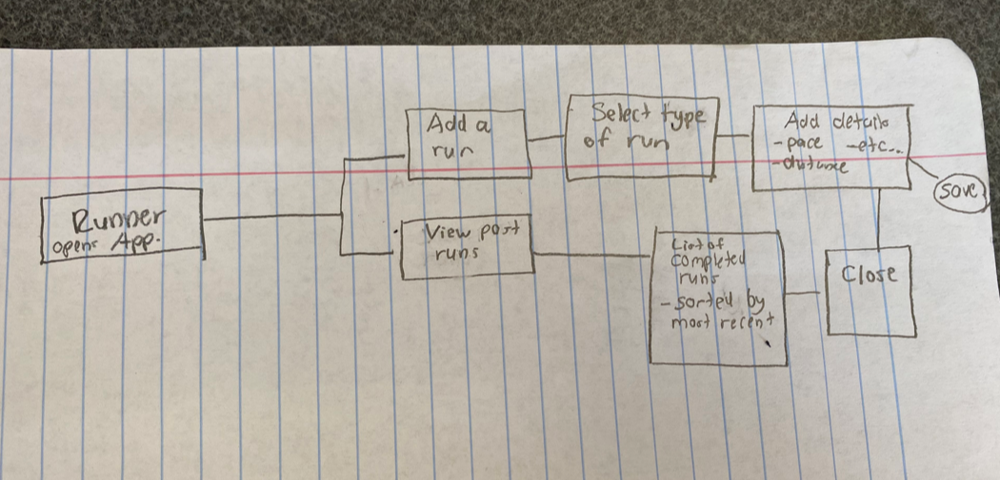

# MVP \- Define Core Features

* Team Name: Workout App 
* Team Members: Chase Ennis 
* Project Name: Workout App 

## Key Features

> List the essential features that will be included in MVP.  

1. Ability to add a run with a reflection with important data metrics about that specific run
2. The ability to open comment and type personal thoughts about a workout
3. The ability to go back and view past runs added on Workout App

***

## User Flow

* 
* Very simple idea of how this will work

## User Stories

* User story 1: "Hello! My name is Paige. I have enjoyed running for many years. In the past, I did not keep track of runs. You could say I was more of a casual. I want a simple application that lets me add runs and then store basic statistics such as time, pace, heartrate, etc. I don't want keeping track of these runs to take extensive time either. Just a 1-3 minute process, depending on how detailed I want to be!"
* User story 2: "Howdy! I'm Phil. I coach cross country high school boys. We have a great team each year. Part of our success is how hard we train over the summers. The dumb school has one week though where my runners and I cannot be in contact. Whenever I ask those kids how each day went when I am allowed back, I get the typical high school boy 'Good' or 'I forget' stuff. They are hard workers, but sometimes struggle to remember details. I am detail-oriented. I just wish there was a way they could add a workout to an application and leave their usual detailed comments there that I am used to getting when I'm with them in person. Then after the week is over, they can just show me the commments they left on their runs and I can coach them accordingly!
* User story 3: "Hi, I am Aaron. I have been running for 5 years. I have accomplished numerous things such as marathons, utras, etc. in those 5 years. I am often asked about it by peers. I try keep track of my workouts by paper-penci, but after all these years the papers are everywhere and it is a clutter! I wish there was a simple application that I could record my workouts to from this point forward. I want to worry about running! Not datakeeping!"

***

## Risks and Mitigations

> Identify potential risks associated with MVP development and launch.
* Runners often complain about drowning in data.
* Not all runners have access to certain data metrics
* Runners do not want to enter the where they are running for privacy reasons.

> Suggest strategies for mitigating these risks.
* Keeping the evaluation tab simple where users can enter the data that they have and are not forced to enter fields they do not want to
* We plan on having a location field, but this also can be left blank if it makes the runner feel more comfortable.

*** 

# Extra Credit:

## Feedback and Iteration

> Describe how user feedback will be collected and analyzed.

* After 3 months, we will prompt users with a feedback survey
* We want to give them enough time to use the app, since one of the major features is viewing past runs. We want to let them accumulate a bank of past runs and test this feature before asking for feedback.
