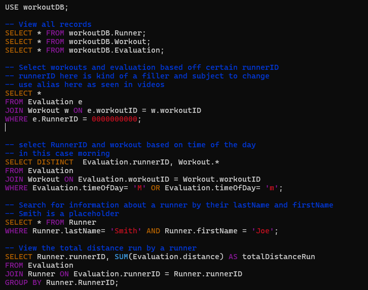

# Workout Project

## Docker Compose File

* 
* Link to file
   * [docker-compose.yml](docker-compose.yml)

## Create Database

* 
* 
* Link to file:
   * [init.sql script](init.sql)

## Create Common Query Scripts

* 
* Link to file
   * [chasescript.sql](SQL-Toolbox/chasescript.sql)
* Description
   * First query loads all the values
   * Second query selects workouts and evaluations based on the `runnerID`
   * Third query filters based on the time of the day (in this case morning)
   * Forth query requests all the information about a runner in the `Runner` table based on their first and last name attributes
   * Fifth query calculates the total distance run from all runs by a particular runner

# Workout Project

## Docker Compose File

* 
* Link to file
   * [docker-compose.yml](docker-compose.yml)

## Start Docker
1. Open `DBeaver`
    * Click `Database` ... `New Database Connection`
    * Chose `MariaDB` as the database type
    * Database: `workoutDB`
    * Password:

## Create Database

* 
* 
* Link to file:
   * [init.sql script](init.sql)

## Create Common Query Scripts

* 
* Link to file
   * [chasescript.sql](SQL-Toolbox/chasescript.sql)
* Description
   * First query loads all the values
   * Second query selects workouts and evaluations based on the `runnerID`
   * Third query filters based on the time of the day (in this case morning)
   * Forth query requests all the information about a runner in the `Runner` table based on their first and last name attributes
   * Fifth query calculates the total distance run from all runs by a particular runner

# Workout Project

## Docker Compose File

* 
* Link to file
   * [docker-compose.yml](docker-compose.yml)

## Create Database

* 
* 
* Link to file:
   * [init.sql script](init.sql)

## Create Common Query Scripts

* 
* Link to file
   * [chasescript.sql](SQL-Toolbox/chasescript.sql)
* Description
   * First query loads all the values
   * Second query selects workouts and evaluations based on the `runnerID`
   * Third query filters based on the time of the day (in this case morning)
   * Forth query requests all the information about a runner in the `Runner` table based on their first and last name attributes
   * Fifth query calculates the total distance run from all runs by a particular runner

