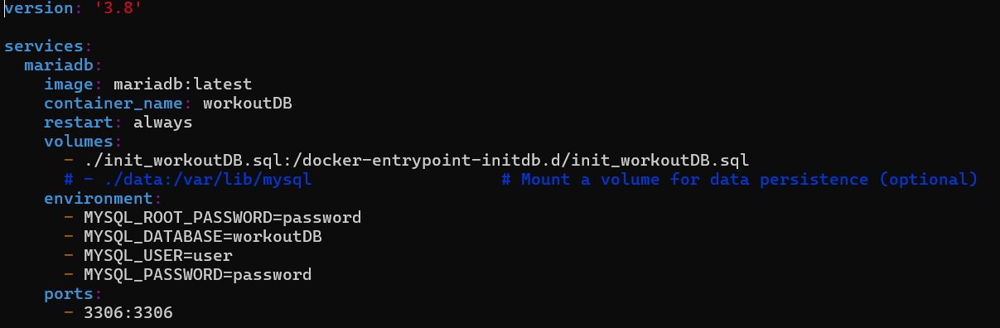
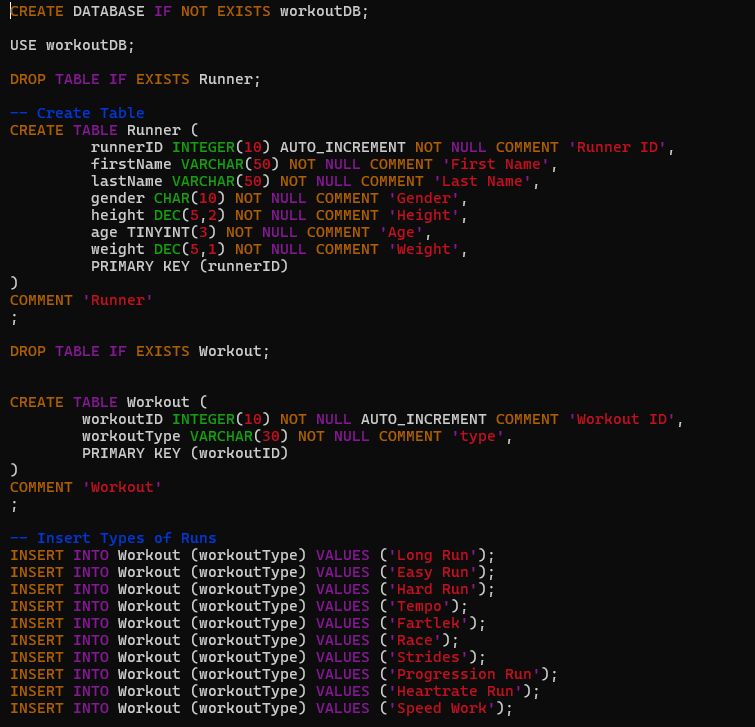

# Workout Project

## Docker Compose File

* 
* Link to file
   * [docker-compose.yml](docker-compose.yml)
### To start container:
* Using this folder as the working directory, `docker compose up` with the shell of your choice.

## Connecting to the Database:
* Using DBeaver, create a new Connection. (Use the MariaDB preset)
   * Database: `workoutDB`
   * Username: `root`
   * Password: `password`
   * Port: `3306`

## Create Database

* 
* 
* Link to file:
   * [init_workoutDB.sql script](init_workoutDB.sql)

## Create Common Query Scripts

* 
* Link to file
   * [chasescript.sql](SQL-Toolbox/chasescript.sql)
* Description
   * First query loads all the values
   * Second query selects workouts and evaluations based on the `runnerID`
   * Third query filters based on the time of the day (in this case morning)
   * Forth query requests all the information about a runner in the `Runner` table based on their first and last name attributes
   * Fifth query calculates the total distance run from all runs by a particular runner

* 
* Link to file
   * [blakescript.png](SQL-Toolbox/blakescript.sql)
* Description
   * First query selects all the data in the `Runner` table.
   * Second query counts how many evaluations are linked to a specific runner based on a given `RunnerID`
   * Third query is the SELECT statement version of the second query, whereas instead of counting, this will actually display the results
   * Forth query requests all the workout types a runner has completed by joining it via the connecting `Evaluation` table where `Evaluation.WorkoutID = Workout.WorkoutID`
   * Fifth query selects every available column and row of data to be displayed. It joins all three tables in the results

