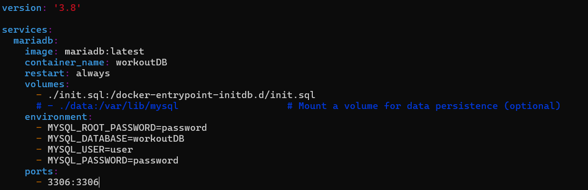
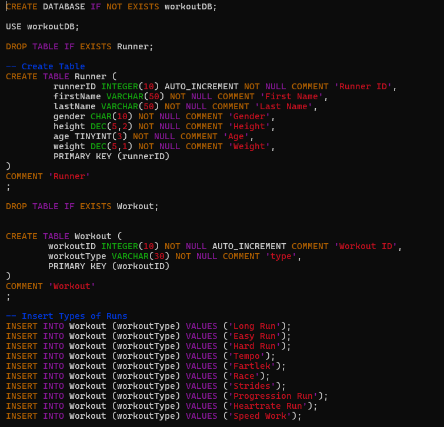
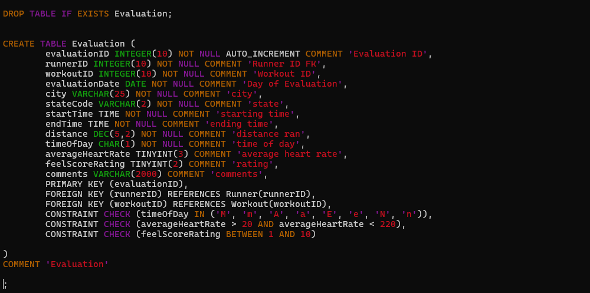

# CEG3900 Database Design

## Models

* Conceptual Model
   * 
* Logical Model
   * 
* Physical Model
   * 

## Docker Compose File

* 
* Link to file
   * [docker-compose.yml](docker-compose.yml)

## Create Database

* 
* 
* Link to file:
   * [init.sql script](init.sql)

## Create Common Query Scripts

* 
* Link to file
   * [chasescript.sql](scripts/chasescript.sql)

