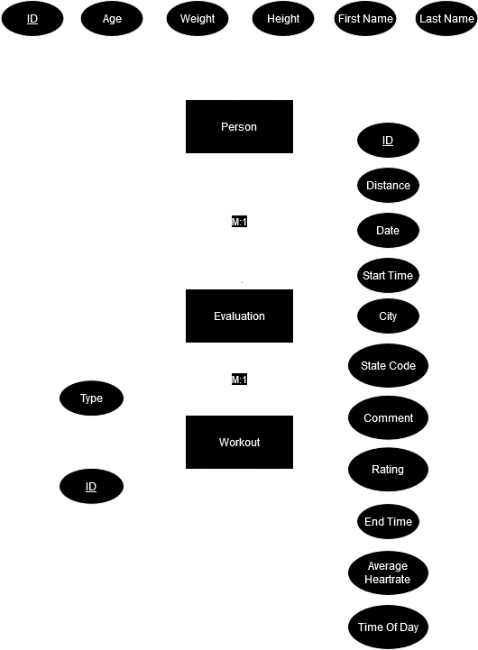
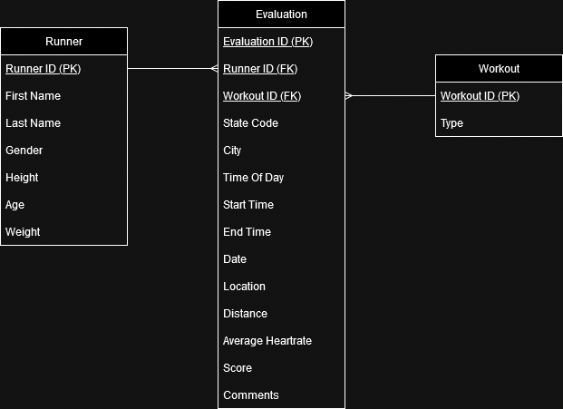
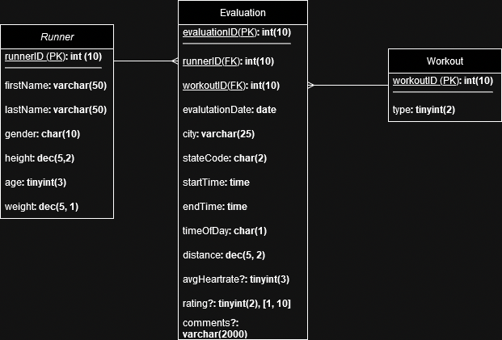

# CEG3900 Database Design

## Models

* Conceptual Model
   * 
   * Description:
`We have a table called which will hold the runner's data (should be called Runner but is misnamed Person in this model). This table will contain the Runner's ID, age, weight, height, and name which will be split into First and Last Name. This has a many to 1 relationship to Evaluation. Evaulation holds all the data for each workout a runner does. This will hold the evaluation ID, distance, date, start time, end time, city, state code, comment, rating, average heartrate, and time of day. Each evaluation is connected to a workout completed by the runner. The workout holds the type of workout and a workout ID.`
* Logical Model
   * 
   * Description:
`This shows the same relationships and tables as the conceptual model, but defines the keys for each table. Runner's primary key will be RunnerID. Evaluation's primary key will be EvaluationID. Evaluation is connected to Runner and Workout via foreign keys: RunnerID and WorkoutID. Workout's primary key is WorkoutID.`
* Physical Model
   * 
   * Description:
`The physical model goes into more depth than the logical model. This model shows the data type of each attribute in each table. For all IDs we chose int(10) to allow a 10 character number ID to uniquely identify the attribute linked to the entity. In Runner, the Names attributes are a varchar(50) to account for longer names. Gender is a char(10) to allow the gender to by typed out. Height is a dec(5,2) to set the format to be feet then inches. Age is a tinyint(3) to account for up to 3 digits for age, though most users should be 2 digits. Weight is dec(5,1) to hold up to 5 digits. In Evaluation we have the evaluationDate as a date and start/endTime's as time. These hold the current date and time statistics. City is a varchar(25) to account for the longest city in the world which has 25 letters. StateCode is a char(2) to account for US states which all have a 2 character abbreviation code. TimeOfDay is a char(1) to have abbreviations of m, n, a, etc... of morning, night, afternoon. These abbreviations will be preset for the user to know and choose. Distance is a dec(5,2) to account for a far distance. AvgHeartrate is a tinyint(3) as a heartrate max would be 3 digits. Rating is a tinyint(2) with a constraint to be only 1 to 10. This is so every workout can be rated 1 to 10 on a standardized scale. Comments is a varchar(2000) to allow comments by the user up to 2000 characters. In Workout the type is a tinyint(2). The type of workout on the frontend will be displayed but in the database will correspond to a number code. This will allow us to more easily store the workout types and take up less memory.`

