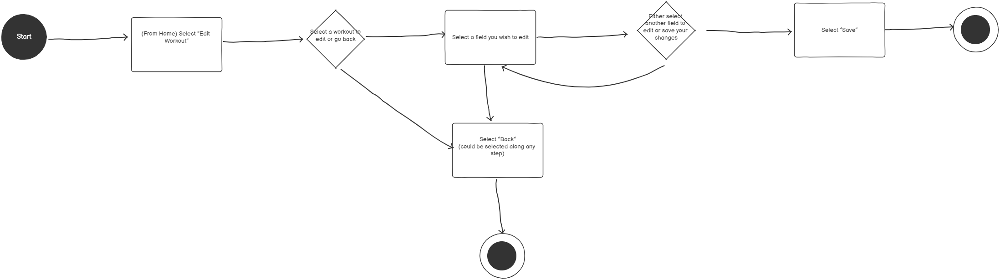
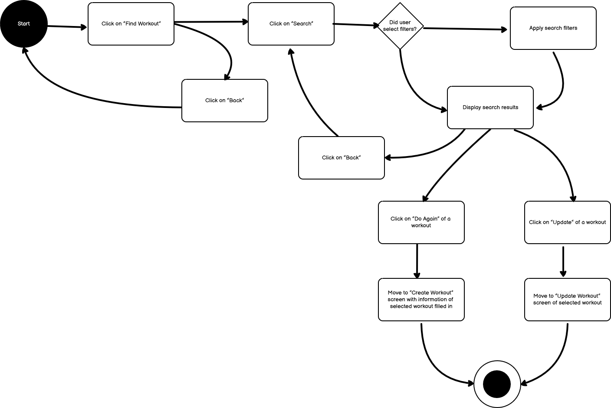
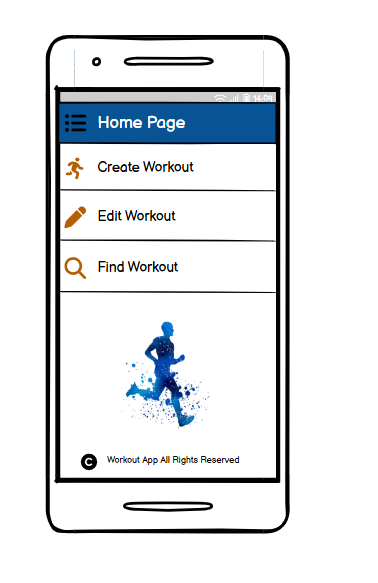
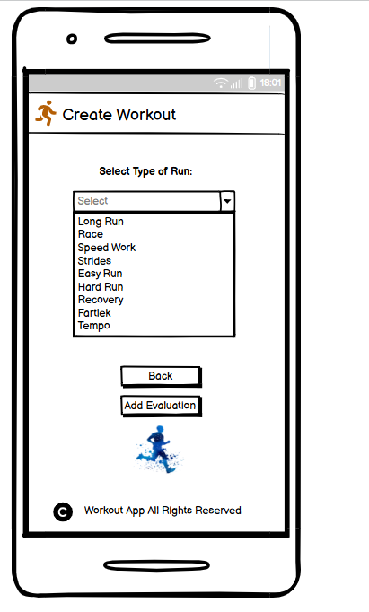
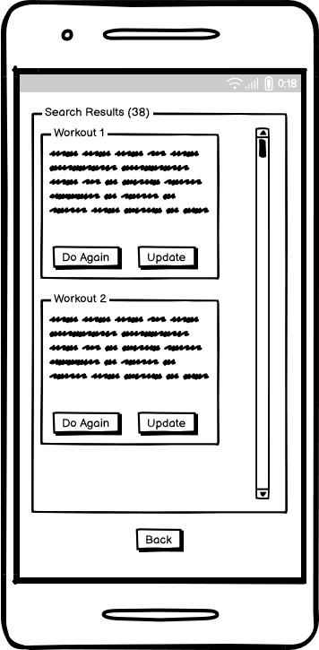
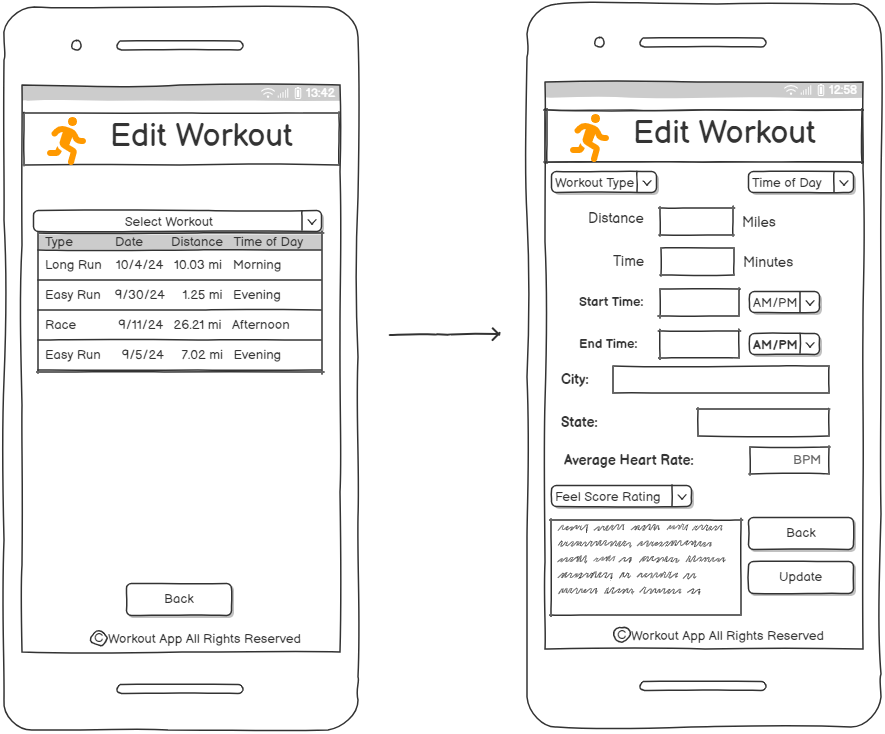

# Workout Project UIUX

## CS3900 Special Topics in Computer Science

### User Flows

(Please note we did not really understand what it meant by a flow for home menu. The user will open the app, and they will be on the home screen with a set of actions they can do)

1. Create (Chase)
  * 
  * The home page will have a `Create` button
  * The user will select the type of workout they completed
  * Then, they will click the `Add Evaluation` button
  * They will fill in the details on the page such as time, distance, etc.
  * They also have an option to go `Back` (it is important not to box the user in)
  * Then, they click `Finish` and it is created

2. Update (Blake)
  * 
  * The home page will have an `Edit` button
  * The user can select a workout they have completed or `Back`
  * The user can then select any field or `Back`
  * Then edit the selected field
  * Finally hit `Update` to save changes, `Back`, or select another field to edit  

3. Search (Connor)
    - 
    - The home page will have a `Search` button to search for previous workouts.
    - The user will be shown options to filter search results by workout type, time of day, city, distance, average heartrate, rating, and date.
    - The user can select `Search` to search for their previous workouts that fit the specified filters, or `Back` to return to the home page.
    - While looking at the search results, the user can press `Update` to update the selected workout, or `Do Again` to move to the `Create` menu, with information of the selected workout already filled in.

### Wireframes

1. Home Page Wireframe (Chase)
   * 
   * Main home menu
   * Has option to Create a Run
   * Has option to Search for a Run
   * Has option to Delete a Run

2. Create Workout Wireframe (Chase)
   * This page has the selection menu for the type of run
   * 
   * This page has the details for the run
   * Once you click `Create`, the workout is added and you go back to the homescreen
   * 
   * 
  
3. Search Wireframe

  - The first screen contains the search filters, a `Back` button to return to the home page, and a `Search` button to search and display the filtered results, moving the user to the second screen.

  - The second screen contains the search results (each of which have an `Update` button to update the selected workout, and a `Do Again` button to move to the `Create` menu with information of the selected workout already filled in), and a `Back` button to return to the first screen.
4. Update Wireframe (Blake)
   * The first screen has the selection menu for the completed workouts the user has.
   * The second screen has all the fields associated with the workout that the user can edit.
   * 
