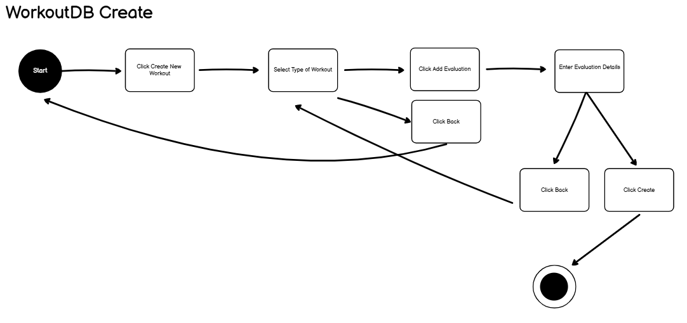

# Workout Project UIUX

## CS3900 Special Topics in Computer Science

### User Flows

1. Create (Chase)
  * 
  * The home page will have a `Create` button
  * The user will select the type of workout they completed
  * Then, they will click the `Add Evaluation` button
  * They will fill in the details on the page such as time, distance, etc.
  * They also have an option to go `Back`
  * Then, they click `Finish` and it is created

### Wireframes

1. Home Page Wireframe (Chase)
   * 
   * Main home menu
   * Has option to Create a Run
   * Has option to Search for a Run
   * Has option to Delete a Run

2. Create Workout Wireframe (Chase)
   * 
   * This page has the selection menu for the type of run
   * 
   * This page has the details for the run
   * Once you click `Create`, the workout is added and you go back to the homescreen
   * 
  
3. Search Wireframe

4. Update Wireframe
